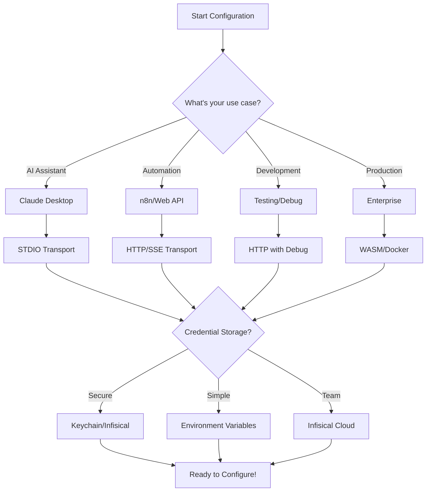
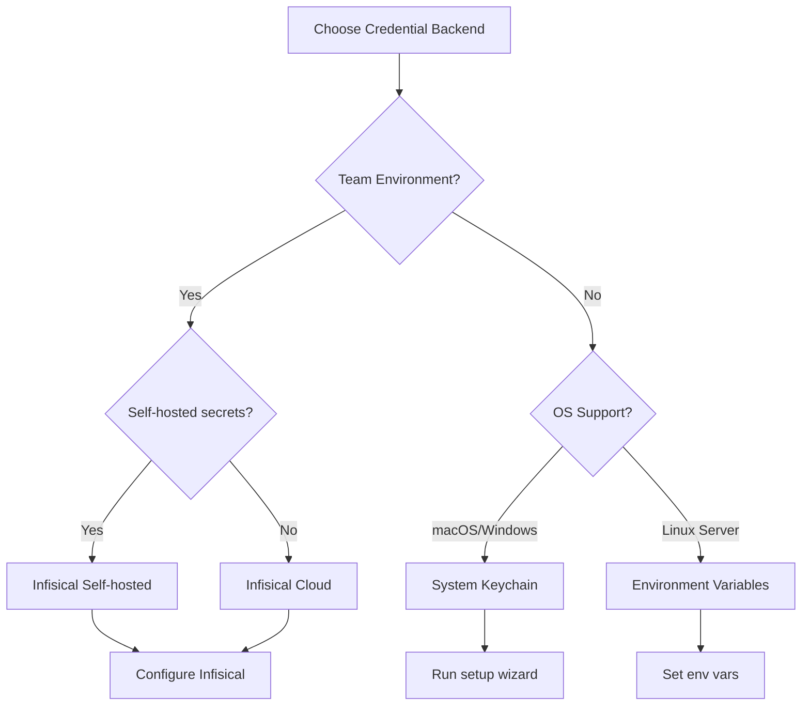

# 🎛️ Complete Configuration Guide

This comprehensive guide covers all configuration options for the Loxone MCP Rust Server with interactive decision trees to help you choose the best setup for your needs.

## 📋 Table of Contents

1. [Quick Decision Tree](#-quick-decision-tree)
2. [Environment Variables Reference](#-environment-variables-reference)
3. [Transport Modes](#-transport-modes)
4. [Credential Storage Backends](#-credential-storage-backends)
5. [Security Configuration](#-security-configuration)
6. [Performance Tuning](#-performance-tuning)
7. [Deployment Scenarios](#-deployment-scenarios)
8. [Interactive Configuration Wizard](#-interactive-configuration-wizard)

## 🌳 Quick Decision Tree



## 📊 Environment Variables Reference

### Core Configuration

| Variable | Description | Default | Required | Example |
|----------|-------------|---------|----------|---------|
| `LOXONE_HOST` | Miniserver IP address or hostname | - | Yes | `192.168.1.10` |
| `LOXONE_USER` | Username for authentication | - | Yes | `admin` |
| `LOXONE_PASS` | Password (if not using keychain) | - | Conditional | `secretpass` |
| `LOXONE_PORT` | Miniserver HTTP port | `80` | No | `8080` |
| `LOXONE_USE_HTTPS` | Enable HTTPS communication | `false` | No | `true` |

### Logging & Debug

| Variable | Description | Default | Required | Example |
|----------|-------------|---------|----------|---------|
| `RUST_LOG` | Rust logging level | `info` | No | `debug` |
| `LOXONE_LOG_LEVEL` | Application log level | `info` | No | `trace` |
| `LOXONE_LOG_FORMAT` | Log output format | `pretty` | No | `json` |
| `LOXONE_DEBUG_MODE` | Enable debug features | `false` | No | `true` |
| `LOXONE_TRACE_REQUESTS` | Log all HTTP requests | `false` | No | `true` |

### Performance

| Variable | Description | Default | Required | Example |
|----------|-------------|---------|----------|---------|
| `LOXONE_CONNECTION_POOL_SIZE` | HTTP connection pool size | `10` | No | `20` |
| `LOXONE_REQUEST_TIMEOUT` | Request timeout (seconds) | `30` | No | `60` |
| `LOXONE_RETRY_ATTEMPTS` | Max retry attempts | `3` | No | `5` |
| `LOXONE_RETRY_DELAY` | Retry delay (ms) | `1000` | No | `2000` |
| `LOXONE_CACHE_TTL` | Cache TTL (seconds) | `300` | No | `600` |
| `LOXONE_BATCH_SIZE` | Max batch operation size | `50` | No | `100` |

### Security

| Variable | Description | Default | Required | Example |
|----------|-------------|---------|----------|---------|
| `LOXONE_API_KEY` | API key for HTTP mode | - | Conditional | `sk-abc123...` |
| `LOXONE_CORS_ORIGINS` | Allowed CORS origins | `*` | No | `https://app.com` |
| `LOXONE_RATE_LIMIT` | Requests per minute | `60` | No | `120` |
| `LOXONE_MAX_REQUEST_SIZE` | Max request size (MB) | `10` | No | `50` |
| `LOXONE_AUDIT_LOG` | Enable audit logging | `false` | No | `true` |
| `LOXONE_CONSENT_REQUIRED` | Require user consent | `true` | No | `false` |

### Credential Backend

| Variable | Description | Default | Required | Example |
|----------|-------------|---------|----------|---------|
| `LOXONE_CREDENTIAL_BACKEND` | Storage backend | `auto` | No | `keychain` |
| `INFISICAL_PROJECT_ID` | Infisical project ID | - | Conditional | `proj_123` |
| `INFISICAL_ENVIRONMENT` | Infisical environment | `dev` | No | `prod` |
| `INFISICAL_CLIENT_ID` | Infisical client ID | - | Conditional | `client_123` |
| `INFISICAL_CLIENT_SECRET` | Infisical client secret | - | Conditional | `secret_123` |
| `INFISICAL_HOST` | Self-hosted Infisical URL | - | No | `https://secrets.company.com` |

### Server Configuration

| Variable | Description | Default | Required | Example |
|----------|-------------|---------|----------|---------|
| `LOXONE_SERVER_HOST` | Bind address (HTTP mode) | `0.0.0.0` | No | `127.0.0.1` |
| `LOXONE_SERVER_PORT` | Server port (HTTP mode) | `3001` | No | `8080` |
| `LOXONE_SSE_ENABLED` | Enable SSE endpoints | `true` | No | `false` |
| `LOXONE_METRICS_ENABLED` | Enable metrics endpoint | `true` | No | `false` |
| `LOXONE_HEALTH_CHECK_INTERVAL` | Health check interval (s) | `60` | No | `120` |

### Feature Flags

| Variable | Description | Default | Required | Example |
|----------|-------------|---------|----------|---------|
| `LOXONE_ENABLE_AUDIO` | Enable audio tools | `true` | No | `false` |
| `LOXONE_ENABLE_CLIMATE` | Enable climate tools | `true` | No | `false` |
| `LOXONE_ENABLE_ENERGY` | Enable energy tools | `true` | No | `false` |
| `LOXONE_ENABLE_SECURITY` | Enable security tools | `true` | No | `false` |
| `LOXONE_ENABLE_WORKFLOWS` | Enable workflow tools | `true` | No | `false` |
| `LOXONE_ENABLE_SAMPLING` | Enable LLM sampling | `false` | No | `true` |

## 🚀 Transport Modes

### STDIO Mode (Claude Desktop)

```bash
# Minimal configuration
export LOXONE_HOST="192.168.1.10"
export LOXONE_USER="admin"
export LOXONE_PASS="password"

# Run server
cargo run --bin loxone-mcp-server -- stdio
```

**When to use:**
- Integration with Claude Desktop
- Direct MCP protocol communication
- Single-user scenarios

### HTTP/SSE Mode (Web Applications)

```bash
# Full configuration
export LOXONE_HOST="192.168.1.10"
export LOXONE_USER="admin"
export LOXONE_API_KEY="sk-your-api-key"
export LOXONE_SERVER_PORT="3001"
export LOXONE_CORS_ORIGINS="https://app.example.com"

# Run server
cargo run --bin loxone-mcp-server -- http --port 3001
```

**When to use:**
- n8n workflows
- Web applications
- Multi-user scenarios
- REST API access needed

### WASM Mode (Edge Deployment)

```bash
# Build configuration
export CARGO_TARGET_WASM32_WASIP2_RUSTFLAGS="-C opt-level=z"
export LOXONE_WASM_MEMORY_LIMIT="50MB"

# Build and deploy
make wasm
wasmtime serve target/wasm32-wasip2/release/loxone-mcp-server.wasm
```

**When to use:**
- Edge computing
- Serverless platforms
- Resource-constrained environments
- Browser-based execution

## 🔐 Credential Storage Backends

### Decision Flow



### 1. System Keychain (Recommended for Desktop)

```bash
# Interactive setup
cargo run --bin loxone-mcp-setup

# Or using CLI
cargo run --bin loxone-mcp-setup -- \
  --host 192.168.1.10 \
  --user admin \
  --password secretpass

# Verify
cargo run --bin loxone-mcp-auth test <credential-id>
```

**Pros:**
- Most secure for desktop
- No plaintext passwords
- OS-level encryption

**Cons:**
- Not portable
- Desktop only

### 2. Infisical (Recommended for Teams)

```bash
# Configure Infisical
export INFISICAL_PROJECT_ID="proj_abc123"
export INFISICAL_ENVIRONMENT="production"
export INFISICAL_CLIENT_ID="client_xyz"
export INFISICAL_CLIENT_SECRET="secret_123"

# Optional: Self-hosted
export INFISICAL_HOST="https://secrets.company.com"

# Credentials will be fetched automatically
cargo run --bin loxone-mcp-server -- http
```

**Pros:**
- Centralized management
- Team collaboration
- Audit trail
- Version control

**Cons:**
- External dependency
- Network required

### 3. Environment Variables (Simple)

```bash
# Direct configuration
export LOXONE_HOST="192.168.1.10"
export LOXONE_USER="admin"
export LOXONE_PASS="password"
export LOXONE_CREDENTIAL_BACKEND="env"

cargo run --bin loxone-mcp-server -- stdio
```

**Pros:**
- Simple setup
- Works everywhere
- Container-friendly

**Cons:**
- Less secure
- Manual management

## 🛡️ Security Configuration

### Production Security Checklist

```yaml
# Recommended production settings
LOXONE_USE_HTTPS: true
LOXONE_API_KEY: "strong-random-key"
LOXONE_CORS_ORIGINS: "https://your-app.com"
LOXONE_RATE_LIMIT: 120
LOXONE_AUDIT_LOG: true
LOXONE_CONSENT_REQUIRED: true
LOXONE_MAX_REQUEST_SIZE: 10
RUST_LOG: "warn"
```

### Security Levels

#### Level 1: Development
```bash
# Minimal security for local development
export LOXONE_CORS_ORIGINS="*"
export LOXONE_RATE_LIMIT="0"  # Disabled
export LOXONE_CONSENT_REQUIRED="false"
```

#### Level 2: Staging
```bash
# Moderate security for testing
export LOXONE_API_KEY="test-key-123"
export LOXONE_CORS_ORIGINS="https://staging.app.com"
export LOXONE_RATE_LIMIT="300"
export LOXONE_AUDIT_LOG="true"
```

#### Level 3: Production
```bash
# Maximum security for production
export LOXONE_USE_HTTPS="true"
export LOXONE_API_KEY="$(openssl rand -base64 32)"
export LOXONE_CORS_ORIGINS="https://app.com"
export LOXONE_RATE_LIMIT="60"
export LOXONE_AUDIT_LOG="true"
export LOXONE_CONSENT_REQUIRED="true"
export LOXONE_CREDENTIAL_BACKEND="infisical"
```

## ⚡ Performance Tuning

### Scenario-Based Configuration

#### High-Traffic API Server
```bash
# Optimize for many concurrent requests
export LOXONE_CONNECTION_POOL_SIZE="50"
export LOXONE_BATCH_SIZE="100"
export LOXONE_CACHE_TTL="600"
export LOXONE_REQUEST_TIMEOUT="10"
export RUST_LOG="warn"
```

#### Real-Time Automation
```bash
# Optimize for low latency
export LOXONE_CONNECTION_POOL_SIZE="20"
export LOXONE_CACHE_TTL="60"
export LOXONE_REQUEST_TIMEOUT="5"
export LOXONE_RETRY_ATTEMPTS="1"
export LOXONE_SSE_ENABLED="true"
```

#### Resource-Constrained
```bash
# Optimize for low memory
export LOXONE_CONNECTION_POOL_SIZE="5"
export LOXONE_BATCH_SIZE="20"
export LOXONE_CACHE_TTL="120"
export LOXONE_METRICS_ENABLED="false"
export LOXONE_WASM_MEMORY_LIMIT="25MB"
```

## 🚀 Deployment Scenarios

### 1. Single User - Claude Desktop

```bash
#!/bin/bash
# setup-claude.sh

# Configure credentials
./setup.sh  # Interactive setup

# Add to Claude Desktop config
cat >> ~/Library/Application\ Support/Claude/claude_desktop_config.json << EOF
{
  "mcpServers": {
    "loxone": {
      "command": "$PWD/target/release/loxone-mcp-server",
      "args": ["stdio"],
      "env": {
        "RUST_LOG": "info"
      }
    }
  }
}
EOF
```

### 2. Team Automation - n8n

```yaml
# docker-compose.yml
version: '3.8'
services:
  loxone-mcp:
    image: loxone-mcp:latest
    environment:
      - LOXONE_HOST=${LOXONE_HOST}
      - LOXONE_API_KEY=${API_KEY}
      - INFISICAL_PROJECT_ID=${INFISICAL_PROJECT_ID}
      - INFISICAL_CLIENT_ID=${INFISICAL_CLIENT_ID}
      - INFISICAL_CLIENT_SECRET=${INFISICAL_CLIENT_SECRET}
    ports:
      - "3001:3001"
    command: ["http", "--port", "3001"]
```

### 3. Edge Deployment - WASM

```bash
#!/bin/bash
# deploy-edge.sh

# Build optimized WASM
export CARGO_TARGET_WASM32_WASIP2_RUSTFLAGS="-C opt-level=z -C lto=fat"
cargo build --target wasm32-wasip2 --release

# Deploy to Cloudflare Workers
wrangler publish
```

### 4. Kubernetes Production

```yaml
# k8s-deployment.yaml
apiVersion: apps/v1
kind: Deployment
metadata:
  name: loxone-mcp
spec:
  replicas: 3
  template:
    spec:
      containers:
      - name: loxone-mcp
        image: loxone-mcp:latest
        env:
        - name: LOXONE_HOST
          valueFrom:
            secretKeyRef:
              name: loxone-secrets
              key: host
        - name: LOXONE_API_KEY
          valueFrom:
            secretKeyRef:
              name: loxone-secrets
              key: api-key
        resources:
          limits:
            memory: "256Mi"
            cpu: "500m"
```

## 🧙 Interactive Configuration Wizard

For an interactive setup experience, use our configuration wizard:

```bash
# Run interactive wizard
cargo run --bin loxone-mcp-wizard

# Or use the web-based wizard
cargo run --bin loxone-mcp-server -- http --wizard
# Open http://localhost:3001/wizard
```

The wizard will guide you through:
1. Choosing your deployment scenario
2. Selecting credential storage
3. Configuring security options
4. Performance tuning
5. Generating configuration files

### Configuration Templates

The wizard can generate configurations for:
- `.env` files
- `docker-compose.yml`
- `kubernetes.yaml`
- `systemd` service files
- Claude Desktop config
- n8n webhook config

## 📚 Additional Resources

- [Security Best Practices](./SECURITY.md)
- [Performance Benchmarks](./BENCHMARKS.md)
- [Troubleshooting Guide](./TROUBLESHOOTING.md)
- [API Reference](./API_REFERENCE.md)

---

<div align="center">

**Need help?** Check our [FAQ](./FAQ.md) or [open an issue](https://github.com/your-repo/issues)

</div>